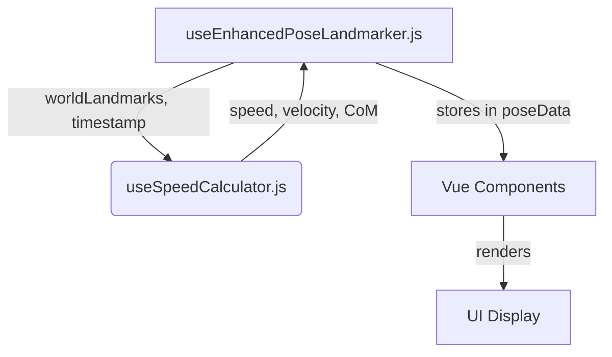

# Technical Design: Movement Speed Calculation

This document outlines the technical design and implementation plan for adding movement speed calculation to the video annotation system.

## 1. Architecture Design

The speed calculation functionality will be encapsulated in a new composable, `useSpeedCalculator.js`, to maintain separation of concerns and ensure the existing `useEnhancedPoseLandmarker.js` remains focused on pose detection.

### Data Flow Diagram



### Composable-Based Architecture

- **`useSpeedCalculator.js`**: A new, self-contained composable responsible for all speed-related calculations. It will accept pose data and return computed speed metrics, ensuring it is reusable and testable in isolation.
- **`useEnhancedPoseLandmarker.js`**: This existing composable will be modified to integrate `useSpeedCalculator.js`. It will orchestrate the data flow, calling the speed calculator with the latest `worldLandmarks` and `timestamp` from MediaPipe and storing the results in its `poseData` map.

## 2. Implementation Details

### `useSpeedCalculator.js` API Design

This composable will expose the following functions and reactive properties:

- **`calculateCoM(landmarks)`**: A pure function that calculates the center of mass from a given set of landmarks using weighted body segment contributions.
- **`calculateVelocity(point1, point2, timeDelta)`**: A utility function to compute the velocity between two 3D points over a time interval.
- **`update(frameData)`**: The main function to process a new frame's data (including `worldLandmarks` and `timestamp`), calculate all relevant metrics, and update its internal state.
- **`speedMetrics`**: A reactive object containing the latest calculated metrics, including `centerOfMass`, `velocity`, and `speed`.

### Code Structure for `useSpeedCalculator.js`

```javascript
// src/composables/useSpeedCalculator.js
import { reactive } from 'vue';

// Using standard human body segment weight distribution
const BODY_SEGMENT_WEIGHTS = {
  // ... weights for head, torso, arms, legs
};

export function useSpeedCalculator() {
  const speedMetrics = reactive({
    centerOfMass: { x: 0, y: 0, z: 0 },
    velocity: { x: 0, y: 0, z: 0 },
    speed: 0, // meters per second
  });

  let lastFrameData = null;

  const calculateCoM = (landmarks) => {
    // ... implementation
  };

  const calculateVelocity = (p1, p2, delta) => {
    // ... implementation
  };

  const update = (frameData) => {
    if (!lastFrameData) {
      lastFrameData = frameData;
      return;
    }

    const com = calculateCoM(frameData.worldLandmarks);
    const lastCoM = calculateCoM(lastFrameData.worldLandmarks);
    const timeDelta = (frameData.timestamp - lastFrameData.timestamp) / 1000; // in seconds

    if (timeDelta > 0) {
      const velocity = calculateVelocity(com, lastCoM, timeDelta);
      speedMetrics.velocity = velocity;
      speedMetrics.speed = Math.sqrt(
        velocity.x ** 2 + velocity.y ** 2 + velocity.z ** 2
      );
    }

    speedMetrics.centerOfMass = com;
    lastFrameData = frameData;
  };

  return {
    speedMetrics,
    update,
  };
}
```

## 3. Performance Considerations

- **Real-time Performance**: The calculations are lightweight vector operations and should not introduce significant overhead. Running them within the existing `requestAnimationFrame` loop in `useEnhancedPoseLandmarker.js` will ensure they don't block the UI thread.
- **Memory**: Storing historical data for smoothing (Phase 4) will be the primary memory concern. A fixed-size circular buffer will be used to cap memory usage.

## 4. Visualization

A new component, `SpeedVisualization.vue`, will be created to render the speed metrics on the canvas. It will be integrated into `App.vue` and receive data from `useEnhancedPoseLandmarker.js`.

### `SpeedVisualization.vue`

This component will:

- Draw the calculated Center of Mass (CoM) as a distinct point.
- Render a velocity vector originating from the CoM.
- Display a numerical readout of the current speed.

```vue
<!-- src/components/SpeedVisualization.vue -->
<template>
  <svg v-if="speedMetrics" class="absolute inset-0 w-full h-full">
    <!-- CoM point -->
    <circle :cx="comCanvas.x" :cy="comCanvas.y" r="5" fill="red" />

    <!-- Velocity vector -->
    <line
      :x1="comCanvas.x"
      :y1="comCanvas.y"
      :x2="comCanvas.x + speedMetrics.velocity.x * 10"
      :y2="comCanvas.y + speedMetrics.velocity.y * 10"
      stroke="red"
      stroke-width="2"
    />

    <!-- Speed display -->
    <text :x="comCanvas.x + 10" :y="comCanvas.y - 10" fill="white">
      {{ speedMetrics.speed.toFixed(2) }} m/s
    </text>
  </svg>
</template>

<script>
// ... component logic to receive speedMetrics and convert world to canvas coordinates
</script>
```
