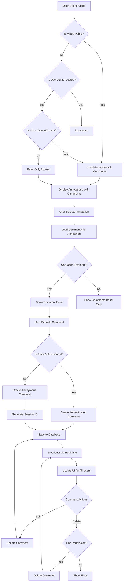
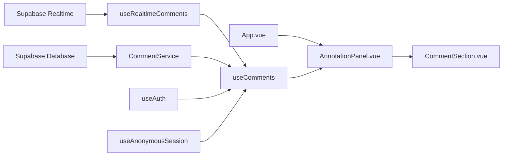

# Video Annotation Comment System Architecture

## Executive Summary

This document outlines the comprehensive architecture for adding a collaborative comment system to the existing video annotation platform. The design enables both authenticated annotation creators and anonymous view-only users to add comments to annotations while maintaining the integrity of the original annotation system.

## Current System Analysis

### Existing Architecture

- **Database**: Supabase PostgreSQL with well-defined schema
- **Authentication**: Supabase Auth with user context management
- **Real-time**: Supabase real-time subscriptions for annotation updates
- **Sharing**: Public video sharing via `?share=videoId` URLs with read-only access
- **UI**: Vue 3 composition API with reactive annotation management

### Key Integration Points

1. **AnnotationPanel.vue**: Primary UI component with `readOnly` mode support
2. **useVideoAnnotations.ts**: Core composable for annotation data management
3. **useRealtimeAnnotations.ts**: Real-time synchronization infrastructure
4. **AnnotationService.ts**: Service layer for annotation CRUD operations
5. **ShareService.ts**: Public video access and permission handling

## 1. Database Schema Design

### Comments Table Structure

```sql
CREATE TABLE annotation_comments (
  id UUID PRIMARY KEY DEFAULT gen_random_uuid(),
  annotation_id UUID NOT NULL REFERENCES annotations(id) ON DELETE CASCADE,
  user_id UUID REFERENCES auth.users(id) ON DELETE SET NULL,
  session_id TEXT, -- For anonymous users
  content TEXT NOT NULL CHECK (length(content) > 0 AND length(content) <= 2000),
  user_display_name TEXT, -- For anonymous users or custom display names
  is_anonymous BOOLEAN DEFAULT FALSE,
  created_at TIMESTAMPTZ DEFAULT NOW(),
  updated_at TIMESTAMPTZ DEFAULT NOW(),

  -- Constraints
  CONSTRAINT valid_user_identification
    CHECK (
      (user_id IS NOT NULL AND session_id IS NULL) OR
      (user_id IS NULL AND session_id IS NOT NULL)
    ),
  CONSTRAINT valid_display_name_for_anonymous
    CHECK (
      (is_anonymous = FALSE) OR
      (is_anonymous = TRUE AND user_display_name IS NOT NULL)
    )
);

-- Indexes for performance
CREATE INDEX idx_annotation_comments_annotation_id ON annotation_comments(annotation_id);
CREATE INDEX idx_annotation_comments_created_at ON annotation_comments(created_at);
CREATE INDEX idx_annotation_comments_user_id ON annotation_comments(user_id);
CREATE INDEX idx_annotation_comments_session_id ON annotation_comments(session_id);

-- RLS Policies
ALTER TABLE annotation_comments ENABLE ROW LEVEL SECURITY;

-- Allow reading comments for public videos or owned videos
CREATE POLICY "Users can read comments on accessible annotations" ON annotation_comments
  FOR SELECT USING (
    EXISTS (
      SELECT 1 FROM annotations a
      JOIN videos v ON a.video_id = v.id
      WHERE a.id = annotation_comments.annotation_id
      AND (
        v.is_public = TRUE OR
        v.owner_id = auth.uid() OR
        a.user_id = auth.uid()
      )
    )
  );

-- Allow authenticated users to create comments
CREATE POLICY "Authenticated users can create comments" ON annotation_comments
  FOR INSERT WITH CHECK (
    auth.uid() IS NOT NULL AND
    user_id = auth.uid() AND
    is_anonymous = FALSE AND
    EXISTS (
      SELECT 1 FROM annotations a
      JOIN videos v ON a.video_id = v.id
      WHERE a.id = annotation_id
      AND (v.is_public = TRUE OR v.owner_id = auth.uid() OR a.user_id = auth.uid())
    )
  );

-- Allow anonymous users to create comments on public videos
CREATE POLICY "Anonymous users can comment on public videos" ON annotation_comments
  FOR INSERT WITH CHECK (
    user_id IS NULL AND
    session_id IS NOT NULL AND
    is_anonymous = TRUE AND
    user_display_name IS NOT NULL AND
    EXISTS (
      SELECT 1 FROM annotations a
      JOIN videos v ON a.video_id = v.id
      WHERE a.id = annotation_id AND v.is_public = TRUE
    )
  );

-- Allow users to update their own comments
CREATE POLICY "Users can update own comments" ON annotation_comments
  FOR UPDATE USING (
    (auth.uid() IS NOT NULL AND user_id = auth.uid()) OR
    (auth.uid() IS NULL AND session_id = current_setting('app.session_id', true))
  );

-- Allow comment deletion by comment author or annotation owner
CREATE POLICY "Users can delete own comments or comments on their annotations" ON annotation_comments
  FOR DELETE USING (
    (auth.uid() IS NOT NULL AND user_id = auth.uid()) OR
    (auth.uid() IS NULL AND session_id = current_setting('app.session_id', true)) OR
    EXISTS (
      SELECT 1 FROM annotations a
      WHERE a.id = annotation_id AND a.user_id = auth.uid()
    )
  );
```

### Anonymous User Session Management

```sql
-- Table to track anonymous user sessions
CREATE TABLE anonymous_sessions (
  session_id TEXT PRIMARY KEY,
  display_name TEXT NOT NULL,
  created_at TIMESTAMPTZ DEFAULT NOW(),
  last_active TIMESTAMPTZ DEFAULT NOW(),
  video_id UUID REFERENCES videos(id) ON DELETE CASCADE
);

CREATE INDEX idx_anonymous_sessions_video_id ON anonymous_sessions(video_id);
CREATE INDEX idx_anonymous_sessions_last_active ON anonymous_sessions(last_active);

-- Cleanup function for old anonymous sessions (older than 24 hours)
CREATE OR REPLACE FUNCTION cleanup_old_anonymous_sessions()
RETURNS void AS $$
BEGIN
  DELETE FROM anonymous_sessions
  WHERE last_active < NOW() - INTERVAL '24 hours';
END;
$$ LANGUAGE plpgsql;
```

## 2. Permission Model

### Access Control Matrix

| User Type                             | Annotation Access          | Comment Access                         | Comment Actions              |
| ------------------------------------- | -------------------------- | -------------------------------------- | ---------------------------- |
| **Annotation Creator**                | Full CRUD                  | Read all comments on their annotations | Create, Edit own, Delete any |
| **Video Owner**                       | Read-only (if not creator) | Read all comments                      | Create, Edit own, Delete any |
| **Authenticated User (Public Video)** | Read-only                  | Read all comments                      | Create, Edit own, Delete own |
| **Anonymous User (Public Video)**     | Read-only                  | Read all comments                      | Create, Edit own, Delete own |
| **Unauthenticated (Private Video)**   | No access                  | No access                              | No access                    |

### Permission Implementation Strategy

```typescript
// Permission checking utility
export class CommentPermissions {
  static canReadComments(
    user: User | null,
    annotation: Annotation,
    video: Video
  ): boolean {
    return (
      video.is_public ||
      video.owner_id === user?.id ||
      annotation.user_id === user?.id
    );
  }

  static canCreateComment(user: User | null, video: Video): boolean {
    return video.is_public || (user && video.owner_id === user.id);
  }

  static canEditComment(
    user: User | null,
    comment: Comment,
    sessionId?: string
  ): boolean {
    return (
      (user && comment.user_id === user.id) ||
      (!user && comment.session_id === sessionId)
    );
  }

  static canDeleteComment(
    user: User | null,
    comment: Comment,
    annotation: Annotation,
    sessionId?: string
  ): boolean {
    // Comment author can delete their own comment
    if (
      (user && comment.user_id === user.id) ||
      (!user && comment.session_id === sessionId)
    ) {
      return true;
    }

    // Annotation creator can delete any comment on their annotation
    return user && annotation.user_id === user.id;
  }
}
```

## 3. API Design

### Comment Service Layer

```typescript
// services/commentService.ts
export class CommentService {
  // Create comment (authenticated user)
  static async createComment(commentData: CommentInsert): Promise<Comment> {
    const { data, error } = await supabase
      .from('annotation_comments')
      .insert(commentData)
      .select(
        `
        *,
        user:users(id, email, full_name, avatar_url)
      `
      )
      .single();

    if (error) throw error;
    return transformDatabaseCommentToApp(data);
  }

  // Create anonymous comment
  static async createAnonymousComment(
    annotationId: string,
    content: string,
    sessionId: string,
    displayName: string
  ): Promise<Comment> {
    // Set session context for RLS
    await supabase.rpc('set_session_context', { session_id: sessionId });

    const commentData = {
      annotation_id: annotationId,
      content,
      session_id: sessionId,
      user_display_name: displayName,
      is_anonymous: true,
    };

    return this.createComment(commentData);
  }

  // Get comments for annotation
  static async getAnnotationComments(annotationId: string): Promise<Comment[]> {
    const { data, error } = await supabase
      .from('annotation_comments')
      .select(
        `
        *,
        user:users(id, email, full_name, avatar_url)
      `
      )
      .eq('annotation_id', annotationId)
      .order('created_at', { ascending: true });

    if (error) throw error;
    return data.map(transformDatabaseCommentToApp);
  }

  // Update comment
  static async updateComment(
    commentId: string,
    updates: CommentUpdate
  ): Promise<Comment> {
    const { data, error } = await supabase
      .from('annotation_comments')
      .update({ ...updates, updated_at: new Date().toISOString() })
      .eq('id', commentId)
      .select(
        `
        *,
        user:users(id, email, full_name, avatar_url)
      `
      )
      .single();

    if (error) throw error;
    return transformDatabaseCommentToApp(data);
  }

  // Delete comment
  static async deleteComment(commentId: string): Promise<void> {
    const { error } = await supabase
      .from('annotation_comments')
      .delete()
      .eq('id', commentId);

    if (error) throw error;
  }

  // Generate anonymous session
  static async createAnonymousSession(
    videoId: string
  ): Promise<{ sessionId: string; displayName: string }> {
    const sessionId = `anon_${Date.now()}_${Math.random()
      .toString(36)
      .substr(2, 9)}`;

    // Get existing anonymous user count for this video
    const { count } = await supabase
      .from('anonymous_sessions')
      .select('*', { count: 'exact', head: true })
      .eq('video_id', videoId);

    const displayName = `Guest User ${(count || 0) + 1}`;

    await supabase.from('anonymous_sessions').insert({
      session_id: sessionId,
      display_name: displayName,
      video_id: videoId,
    });

    return { sessionId, displayName };
  }
}
```

### Type Definitions

```typescript
// types/database.ts additions
export interface DatabaseComment {
  id: string;
  annotation_id: string;
  user_id: string | null;
  session_id: string | null;
  content: string;
  user_display_name: string | null;
  is_anonymous: boolean;
  created_at: string;
  updated_at: string;
}

export interface Comment {
  id: string;
  annotation_id: string;
  content: string;
  user_id: string | null;
  session_id: string | null;
  user_display_name: string | null;
  is_anonymous: boolean;
  created_at: string;
  updated_at: string;
  user?: {
    id: string;
    email: string;
    full_name?: string;
    avatar_url?: string;
  };
}

export type CommentInsert = Omit<
  DatabaseComment,
  'id' | 'created_at' | 'updated_at'
>;
export type CommentUpdate = Partial<Pick<DatabaseComment, 'content'>>;

// Transform functions
export function transformDatabaseCommentToApp(dbComment: any): Comment {
  return {
    id: dbComment.id,
    annotation_id: dbComment.annotation_id,
    content: dbComment.content,
    user_id: dbComment.user_id,
    session_id: dbComment.session_id,
    user_display_name: dbComment.user_display_name,
    is_anonymous: dbComment.is_anonymous,
    created_at: dbComment.created_at,
    updated_at: dbComment.updated_at,
    user: dbComment.user,
  };
}
```

## 4. Real-time Architecture

### Enhanced Real-time Composable

```typescript
// composables/useRealtimeComments.ts
export function useRealtimeComments(
  annotationId: Ref<string>,
  comments: Ref<Comment[]>
) {
  const isConnected = ref(false);
  let subscription: RealtimeChannel | null = null;

  const setupRealtimeSubscription = () => {
    if (!toValue(annotationId)) return;

    subscription = supabase
      .channel(`annotation_comments:${toValue(annotationId)}`)
      .on(
        'postgres_changes',
        {
          event: 'INSERT',
          schema: 'public',
          table: 'annotation_comments',
          filter: `annotation_id=eq.${toValue(annotationId)}`,
        },
        async (payload) => {
          // Fetch full comment data with user info
          const { data } = await supabase
            .from('annotation_comments')
            .select(
              `
              *,
              user:users(id, email, full_name, avatar_url)
            `
            )
            .eq('id', payload.new.id)
            .single();

          if (data) {
            const newComment = transformDatabaseCommentToApp(data);
            if (!comments.value.find((c) => c.id === newComment.id)) {
              comments.value.push(newComment);
              comments.value.sort(
                (a, b) =>
                  new Date(a.created_at).getTime() -
                  new Date(b.created_at).getTime()
              );
            }
          }
        }
      )
      .on(
        'postgres_changes',
        {
          event: 'UPDATE',
          schema: 'public',
          table: 'annotation_comments',
          filter: `annotation_id=eq.${toValue(annotationId)}`,
        },
        async (payload) => {
          const { data } = await supabase
            .from('annotation_comments')
            .select(
              `
              *,
              user:users(id, email, full_name, avatar_url)
            `
            )
            .eq('id', payload.new.id)
            .single();

          if (data) {
            const updatedComment = transformDatabaseCommentToApp(data);
            const index = comments.value.findIndex(
              (c) => c.id === updatedComment.id
            );
            if (index !== -1) {
              comments.value[index] = updatedComment;
            }
          }
        }
      )
      .on(
        'postgres_changes',
        {
          event: 'DELETE',
          schema: 'public',
          table: 'annotation_comments',
          filter: `annotation_id=eq.${toValue(annotationId)}`,
        },
        (payload) => {
          comments.value = comments.value.filter(
            (c) => c.id !== payload.old.id
          );
        }
      )
      .subscribe((status) => {
        isConnected.value = status === 'SUBSCRIBED';
      });
  };

  const cleanup = () => {
    if (subscription) {
      supabase.removeChannel(subscription);
      subscription = null;
    }
    isConnected.value = false;
  };

  watch(
    annotationId,
    (newId, oldId) => {
      if (oldId) cleanup();
      if (newId) setupRealtimeSubscription();
    },
    { immediate: true }
  );

  onUnmounted(cleanup);

  return {
    isConnected: readonly(isConnected),
    cleanup,
  };
}
```

## 5. UI Integration Strategy

### Enhanced AnnotationPanel.vue Integration

```vue
<!-- AnnotationPanel.vue additions -->
<script setup>
// Add to existing imports
import { useComments } from '../composables/useComments';
import CommentSection from './CommentSection.vue';

// Add to existing props
const props = defineProps({
  // ... existing props
  allowComments: {
    type: Boolean,
    default: true,
  },
});

// Add comment functionality
const {
  comments,
  isLoadingComments,
  addComment,
  updateComment,
  deleteComment,
  canComment,
  canDeleteComment,
} = useComments();

// Load comments when annotation is selected
watch(
  () => props.selectedAnnotation,
  async (annotation) => {
    if (annotation && props.allowComments) {
      await loadCommentsForAnnotation(annotation.id);
    }
  }
);
</script>

<template>
  <!-- Add to existing template after annotation details -->
  <div
    v-if="selectedAnnotation && allowComments"
    class="border-t border-gray-200"
  >
    <CommentSection
      :annotation="selectedAnnotation"
      :comments="comments"
      :can-comment="canComment"
      :can-delete-comment="canDeleteComment"
      :is-loading="isLoadingComments"
      :read-only="readOnly"
      @add-comment="addComment"
      @update-comment="updateComment"
      @delete-comment="deleteComment"
    />
  </div>
</template>
```

### CommentSection Component

```vue
<!-- components/CommentSection.vue -->
<template>
  <div class="comment-section p-4 bg-gray-50">
    <div class="flex items-center justify-between mb-3">
      <h4 class="text-sm font-medium text-gray-900">
        Comments ({{ comments.length }})
      </h4>
    </div>

    <!-- Comment List -->
    <div class="space-y-3 mb-4 max-h-60 overflow-y-auto">
      <div
        v-for="comment in comments"
        :key="comment.id"
        class="bg-white rounded-lg p-3 border border-gray-200"
      >
        <div class="flex items-start justify-between">
          <div class="flex-1">
            <div class="flex items-center space-x-2 mb-1">
              <span class="text-sm font-medium text-gray-900">
                {{ getDisplayName(comment) }}
              </span>
              <span class="text-xs text-gray-500">
                {{ formatTimeAgo(comment.created_at) }}
              </span>
              <span
                v-if="comment.is_anonymous"
                class="text-xs bg-gray-100 text-gray-600 px-1 rounded"
              >
                Guest
              </span>
            </div>
            <p class="text-sm text-gray-700">{{ comment.content }}</p>
          </div>
          <button
            v-if="canDeleteComment(comment)"
            @click="$emit('delete-comment', comment.id)"
            class="text-gray-400 hover:text-red-500 ml-2"
            title="Delete comment"
          >
            <svg class="w-4 h-4" fill="currentColor" viewBox="0 0 20 20">
              <path
                fill-rule="evenodd"
                d="M4.293 4.293a1 1 0 011.414 0L10 8.586l4.293-4.293a1 1 0 111.414 1.414L11.414 10l4.293 4.293a1 1 0 01-1.414 1.414L10 11.414l-4.293 4.293a1 1 0 01-1.414-1.414L8.586 10 4.293 5.707a1 1 0 010-1.414z"
                clip-rule="evenodd"
              ></path>
            </svg>
          </button>
        </div>
      </div>
    </div>

    <!-- Add Comment Form -->
    <div v-if="canComment && !readOnly" class="border-t border-gray-200 pt-3">
      <div class="flex space-x-2">
        <textarea
          v-model="newCommentContent"
          placeholder="Add a comment..."
          class="flex-1 text-sm border border-gray-300 rounded-md px-3 py-2 focus:outline-none focus:ring-2 focus:ring-blue-500 focus:border-transparent resize-none"
          rows="2"
          maxlength="2000"
        ></textarea>
        <button
          @click="submitComment"
          :disabled="!newCommentContent.trim() || isSubmitting"
          class="px-3 py-2 bg-blue-600 text-white text-sm rounded-md hover:bg-blue-700 disabled:opacity-50 disabled:cursor-not-allowed"
        >
          Post
        </button>
      </div>
      <div class="text-xs text-gray-500 mt-1">
        {{ newCommentContent.length }}/2000 characters
      </div>
    </div>
  </div>
</template>

<script setup>
import { ref } from 'vue';

const props = defineProps({
  annotation: Object,
  comments: Array,
  canComment: Boolean,
  canDeleteComment: Function,
  isLoading: Boolean,
  readOnly: Boolean,
});

const emit = defineEmits(['add-comment', 'update-comment', 'delete-comment']);

const newCommentContent = ref('');
const isSubmitting = ref(false);

const getDisplayName = (comment) => {
  if (comment.is_anonymous) {
    return comment.user_display_name || 'Anonymous User';
  }
  return comment.user?.full_name || comment.user?.email || 'Unknown User';
};

const formatTimeAgo = (dateString) => {
  const date = new Date(dateString);
  const now = new Date();
  const diffInSeconds = Math.floor((now - date) / 1000);

  if (diffInSeconds < 60) return 'just now';
  if (diffInSeconds < 3600) return `${Math.floor(diffInSeconds / 60)}m ago`;
  if (diffInSeconds < 86400) return `${Math.floor(diffInSeconds / 3600)}h ago`;
  return `${Math.floor(diffInSeconds / 86400)}d ago`;
};

const submitComment = async () => {
  if (!newCommentContent.value.trim()) return;

  isSubmitting.value = true;
  try {
    await emit('add-comment', {
      annotation_id: props.annotation.id,
      content: newCommentContent.value.trim(),
    });
    newCommentContent.value = '';
  } finally {
    isSubmitting.value = false;
  }
};
</script>
```

## 6. Data Flow Architecture

### Comment Lifecycle Flow



### Component Data Flow



## 7. Security Considerations

### Data Protection

- **Input Validation**: All comment content is validated for length (max 2000 chars) and sanitized
- **XSS Prevention**: Comment content is escaped before rendering
- **Rate Limiting**: Implement rate limiting for comment creation (max 10 comments per minute per user/session)
- **Content Filtering**: Optional profanity filter for comment content

### Access Control

- **RLS Policies**: Comprehensive Row Level Security policies prevent unauthorized access
- **Session Security**: Anonymous sessions are time-limited (24 hours) and video-scoped
- **Permission Validation**: All operations validate permissions at both client and server level

### Privacy

- **Anonymous Users**: Session IDs are not personally identifiable
- **Data Retention**: Anonymous sessions and comments are cleaned up after 30 days of inactivity
- **User Data**: Authenticated user data follows existing privacy policies

## 8. Migration Strategy

### Database Migration

```sql
-- Migration script: 001_add_comment_system.sql
BEGIN;

-- Create comments table
CREATE TABLE annotation_comments (
  -- [Full table definition from above]
);

-- Create anonymous sessions table
CREATE TABLE anonymous_sessions (
  -- [Full table definition from above]
);

-- Add indexes
-- [All indexes from above]

-- Add RLS policies
-- [All policies from above]

-- Create helper functions
CREATE OR REPLACE FUNCTION set_session_context(session_id TEXT)
RETURNS void AS $$
BEGIN
  PERFORM set_config('app.session_id', session_id, true);
END;
$$ LANGUAGE plpgsql;

COMMIT;
```

### Backward Compatibility

- **Existing Annotations**: No changes to existing annotation structure
- **API Compatibility**: All existing annotation APIs remain unchanged
- **UI Compatibility**: Comments are additive - existing UI works without modification
- **Feature Flags**: Comment system can be disabled per video or globally

## 9. Performance Considerations

### Database Optimization

- **Indexes**: Strategic indexes on frequently queried columns
- **Pagination**: Comments loaded in batches of 50 for large annotation sets
- **Caching**: Comment counts cached at annotation level
- **Cleanup**: Automated cleanup of old anonymous sessions

### Real-time Optimization

- **Channel Scoping**: Real-time subscriptions scoped to individual annotations
- **Selective Updates**: Only relevant comment changes broadcast to subscribers
- **Connection Management**: Automatic cleanup of stale connections

### UI Performance

- **Virtual Scrolling**: For annotations with many comments (>100)
- **Lazy Loading**: Comments loaded only when annotation is selected
- **Debounced Input**: Comment form input debounced to prevent excessive API calls

## 10. Implementation Phases

### Phase 1: Core Infrastructure (Week 1-2)

- Database schema and migrations
- Basic CommentService implementation
- Permission system implementation
- Anonymous session management

### Phase 2: UI Integration (Week 2-3)

- CommentSection component
- AnnotationPanel integration
- Basic comment CRUD operations
- Anonymous user flow

### Phase 3: Real-time Features (Week 3-4)

- Real-time comment synchronization
- Live comment updates
- Presence indicators for active commenters

### Phase 4: Polish & Optimization (Week 4-5)

- Performance optimizations
- Error handling and edge cases
- Accessibility improvements
- Testing and bug fixes

## Conclusion

This architecture provides a robust, scalable comment system that seamlessly integrates with the existing video annotation platform. The design maintains the integrity of the original annotation system while adding collaborative commenting capabilities for both authenticated and anonymous users.

Key benefits:

- **Non-intrusive**: No changes to existing annotation functionality
- **Secure**: Comprehensive permission model and security measures
- **Scalable**: Efficient database design and real-time architecture
- **User-friendly**: Intuitive UI integration with existing workflows
- **Flexible**: Support for both authenticated and anonymous users

The modular design allows for incremental implementation and future enhancements while maintaining system stability and performance.
