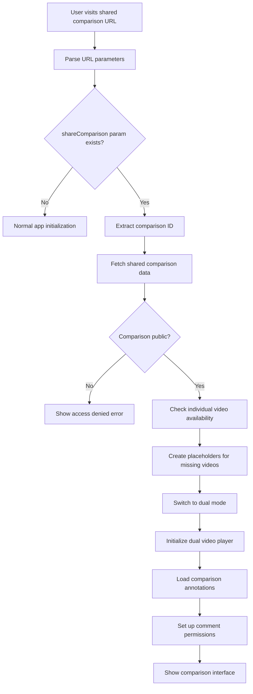

# Dual Video Comparison Sharing - Technical Design Document

## Executive Summary

This document outlines the comprehensive technical design for implementing shareable links for dual video comparisons in the video annotation platform. The solution extends the existing single video sharing system to support comparison videos while maintaining full backward compatibility.

## Current Architecture Analysis

### Existing Components

- **ShareService**: Handles single video sharing with `?share=${videoId}` URL format
- **ShareModal**: UI component for generating and displaying share links (single video only)
- **ComparisonVideoService**: Manages dual video comparisons with robust metadata handling
- **App.vue**: Main application state with `currentVideoId` tracking for single videos
- **Database**: `videos` table has `is_public` column, `comparison_videos` table lacks sharing support

### Critical Gaps Identified

1. `comparison_videos` table missing `is_public` column
2. ShareService only accepts single `videoId` parameter
3. ShareModal hardcoded for single video props
4. No URL parsing for comparison videos
5. App.vue share button disabled in dual mode (no `currentVideoId`)
6. No anonymous commenting for comparison contexts

## Database Schema Design

### Migration: Add Sharing Support to Comparison Videos

```sql
-- Migration: 004_add_comparison_video_sharing.sql
ALTER TABLE comparison_videos
ADD COLUMN is_public BOOLEAN DEFAULT FALSE;

-- Add index for performance
CREATE INDEX idx_comparison_videos_is_public
ON comparison_videos(is_public)
WHERE is_public = TRUE;

-- Add updated_at trigger if not exists
CREATE OR REPLACE FUNCTION update_updated_at_column()
RETURNS TRIGGER AS $$
BEGIN
    NEW.updated_at = CURRENT_TIMESTAMP;
    RETURN NEW;
END;
$$ language 'plpgsql';

-- Apply trigger to comparison_videos if not exists
DROP TRIGGER IF EXISTS update_comparison_videos_updated_at ON comparison_videos;
CREATE TRIGGER update_comparison_videos_updated_at
    BEFORE UPDATE ON comparison_videos
    FOR EACH ROW
    EXECUTE FUNCTION update_updated_at_column();
```

### Updated Database Types

```typescript
// Add to src/types/database.ts
export interface DatabaseComparisonVideo {
  id: string;
  user_id: string;
  title: string;
  description?: string;
  video_a_id: string;
  video_b_id: string;
  duration?: number;
  fps?: number;
  total_frames?: number;
  thumbnail_url?: string;
  thumbnail_layout?: string;
  is_public: boolean; // NEW FIELD
  created_at: string;
  updated_at: string;
}

// New interface for shared comparison videos
export interface SharedComparisonVideoWithCommentPermissions {
  id: string;
  title: string;
  description?: string;
  video_a: SharedVideoWithCommentPermissions | null;
  video_b: SharedVideoWithCommentPermissions | null;
  is_public: boolean;
  can_comment: boolean;
  annotations: any[];
  thumbnail_url?: string;
  duration?: number;
  fps?: number;
  total_frames?: number;
}
```

## URL Structure Design

### Chosen Approach: Separate Parameter

- **Single Video**: `?share=${videoId}`
- **Comparison Video**: `?shareComparison=${comparisonId}`

### Benefits

- Clear separation of concerns
- No ambiguity in URL parsing
- Minimal complexity
- Easy to understand and debug
- Backward compatible

### URL Parsing Logic

```typescript
// Enhanced parseShareUrl method
static parseShareUrl(): { type: 'video' | 'comparison' | null, id: string | null } {
  const urlParams = new URLSearchParams(window.location.search);

  const videoId = urlParams.get('share');
  const comparisonId = urlParams.get('shareComparison');

  if (videoId) {
    return { type: 'video', id: videoId };
  }

  if (comparisonId) {
    return { type: 'comparison', id: comparisonId };
  }

  return { type: null, id: null };
}
```

## Service Layer Extensions

### ShareService Enhancements

```typescript
// New methods to add to ShareService class

/**
 * Create shareable link for comparison video
 */
static async createComparisonShareableLink(comparisonId: string): Promise<string> {
  try {
    // Make the comparison video public
    await supabase
      .from('comparison_videos')
      .update({ is_public: true })
      .eq('id', comparisonId);

    // Generate the shareable URL
    const baseUrl = window.location.origin;
    const shareUrl = `${baseUrl}?shareComparison=${comparisonId}`;

    return shareUrl;
  } catch (error) {
    console.error('❌ [ShareService] Error creating comparison shareable link:', error);
    throw error;
  }
}

/**
 * Get shared comparison video with comment permissions
 */
static async getSharedComparisonVideoWithCommentPermissions(
  comparisonId: string
): Promise<SharedComparisonVideoWithCommentPermissions> {
  try {
    // Get the comparison video (must be public)
    const { data: comparison, error: comparisonError } = await supabase
      .from('comparison_videos')
      .select('*')
      .eq('id', comparisonId)
      .eq('is_public', true)
      .single();

    if (comparisonError || !comparison) {
      throw new Error('Comparison video not found or not public');
    }

    // Get both videos (may be public or private)
    const [videoAResult, videoBResult] = await Promise.all([
      supabase.from('videos').select('*').eq('id', comparison.video_a_id).single(),
      supabase.from('videos').select('*').eq('id', comparison.video_b_id).single()
    ]);

    // Handle missing/private videos with placeholders
    const videoA = this.createVideoPlaceholderIfNeeded(videoAResult, 'Video A');
    const videoB = this.createVideoPlaceholderIfNeeded(videoBResult, 'Video B');

    // Get annotations for the comparison context
    const { data: annotations } = await supabase
      .from('annotations')
      .select('*')
      .eq('video_id', comparisonId)
      .order('timestamp', { ascending: true });

    const mappedAnnotations = annotations?.map((annotation) => ({
      ...annotation,
      annotationType: annotation.annotation_type,
      drawingData: annotation.drawing_data,
    })) || [];

    // Comment permissions for comparison videos
    const canComment = comparison.is_public;

    return {
      id: comparison.id,
      title: comparison.title,
      description: comparison.description,
      video_a: videoA,
      video_b: videoB,
      is_public: comparison.is_public,
      can_comment: canComment,
      annotations: mappedAnnotations,
      thumbnail_url: comparison.thumbnail_url,
      duration: comparison.duration,
      fps: comparison.fps,
      total_frames: comparison.total_frames,
    };
  } catch (error) {
    console.error('❌ [ShareService] Error getting shared comparison video:', error);
    throw error;
  }
}

/**
 * Create placeholder for missing/private videos
 */
private static createVideoPlaceholderIfNeeded(
  videoResult: any,
  fallbackTitle: string
): SharedVideoWithCommentPermissions | null {
  const { data: video, error } = videoResult;

  if (error || !video) {
    return {
      id: 'placeholder',
      title: `${fallbackTitle} (Unavailable)`,
      description: 'This video is no longer available or has been made private',
      url: '',
      file_path: '',
      video_type: 'placeholder',
      is_public: false,
      can_comment: false,
      annotations: [],
    };
  }

  // Check if video is public for shared access
  if (!video.is_public) {
    return {
      id: 'placeholder',
      title: `${video.title} (Private)`,
      description: 'This video has been made private and is no longer accessible',
      url: '',
      file_path: '',
      video_type: 'placeholder',
      is_public: false,
      can_comment: false,
      annotations: [],
    };
  }

  // Return full video data with comment permissions
  return {
    id: video.id,
    title: video.title,
    description: video.description,
    url: video.url,
    file_path: video.file_path,
    video_type: video.video_type,
    is_public: video.is_public,
    can_comment: this.canCommentOnSharedVideo(video),
    annotations: [], // Will be loaded separately if needed
  };
}

/**
 * Make comparison video private
 */
static async makeComparisonVideoPrivate(comparisonId: string): Promise<void> {
  try {
    await supabase
      .from('comparison_videos')
      .update({ is_public: false })
      .eq('id', comparisonId);
  } catch (error) {
    console.error('❌ [ShareService] Error making comparison video private:', error);
    throw error;
  }
}

/**
 * Enhanced URL parsing with type detection
 */
static parseShareUrl(): { type: 'video' | 'comparison' | null, id: string | null } {
  const urlParams = new URLSearchParams(window.location.search);

  const videoId = urlParams.get('share');
  const comparisonId = urlParams.get('shareComparison');

  if (videoId) {
    return { type: 'video', id: videoId };
  }

  if (comparisonId) {
    return { type: 'comparison', id: comparisonId };
  }

  return { type: null, id: null };
}

/**
 * Get comment permission context for comparison videos
 */
static async getComparisonCommentPermissionContext(
  comparisonId: string,
  sessionId?: string
): Promise<CommentPermissionContext> {
  try {
    // Get the comparison video to check if it's public
    const { data: comparison, error } = await supabase
      .from('comparison_videos')
      .select('id, is_public')
      .eq('id', comparisonId)
      .eq('is_public', true)
      .single();

    if (error || !comparison) {
      return {
        canComment: false,
        isAnonymous: false,
        reason: 'Comparison video not found or not public',
      };
    }

    const canComment = comparison.is_public;
    const isAnonymous = !sessionId ? false : true;

    return {
      canComment,
      isAnonymous,
      sessionId,
    };
  } catch (error) {
    console.error('❌ [ShareService] Error getting comparison comment permissions:', error);
    return {
      canComment: false,
      isAnonymous: false,
      reason: 'Error checking permissions',
    };
  }
}
```

## Component Interface Design

### ShareModal Enhancements

```typescript
// Updated props interface
interface ShareModalProps {
  isVisible: boolean;
  videoId?: string; // For single video sharing
  comparisonId?: string; // For comparison video sharing
  shareType?: 'video' | 'comparison'; // Explicit type
}

// Updated component logic
const props = defineProps({
  isVisible: {
    type: Boolean,
    default: false,
  },
  videoId: {
    type: String,
    default: '',
  },
  comparisonId: {
    type: String,
    default: '',
  },
  shareType: {
    type: String,
    default: 'video',
    validator: (value: string) => ['video', 'comparison'].includes(value),
  },
});

// Updated methods
const generateShareLink = async () => {
  if (props.shareType === 'comparison') {
    if (!props.comparisonId) {
      error.value = 'No comparison video selected to share';
      return;
    }

    try {
      const url = await ShareService.createComparisonShareableLink(
        props.comparisonId
      );
      shareUrl.value = url;
    } catch (err) {
      error.value =
        'Failed to generate comparison share link. Please try again.';
    }
  } else {
    // Existing single video logic
    if (!props.videoId) {
      error.value = 'No video selected to share';
      return;
    }

    try {
      const url = await ShareService.createShareableLink(props.videoId);
      shareUrl.value = url;
    } catch (err) {
      error.value = 'Failed to generate share link. Please try again.';
    }
  }
};

// Updated template content
const modalTitle = computed(() => {
  return props.shareType === 'comparison'
    ? 'Share Comparison Video'
    : 'Share Video';
});

const shareDescription = computed(() => {
  return props.shareType === 'comparison'
    ? 'Generate a shareable link that includes your comparison video and all annotations.'
    : 'Generate a shareable link that includes your video and all annotations.';
});
```

## State Management Updates

### App.vue Enhancements

```typescript
// New state variables
const currentComparisonId = ref(null);
const isSharedComparison = ref(false);

// Updated computed properties
const canShare = computed(() => {
  return playerMode.value === 'single'
    ? !!currentVideoId.value
    : !!currentComparisonId.value;
});

const shareModalProps = computed(() => {
  if (playerMode.value === 'dual' && currentComparisonId.value) {
    return {
      shareType: 'comparison',
      comparisonId: currentComparisonId.value,
    };
  } else {
    return {
      shareType: 'video',
      videoId: currentVideoId.value,
    };
  }
});

// Updated methods
const openShareModal = () => {
  if (canShare.value) {
    isShareModalVisible.value = true;
  }
};

// Enhanced initialization for shared content
const initializeSharedContent = async () => {
  const shareData = ShareService.parseShareUrl();

  if (!shareData.type || !shareData.id) {
    return;
  }

  try {
    if (shareData.type === 'video') {
      await initializeSharedVideo(shareData.id);
    } else if (shareData.type === 'comparison') {
      await initializeSharedComparison(shareData.id);
    }
  } catch (error) {
    console.error('❌ [App] Error initializing shared content:', error);
    // Show error notification
  }
};

const initializeSharedComparison = async (comparisonId: string) => {
  try {
    isSharedComparison.value = true;

    // Get shared comparison data
    const sharedComparison =
      await ShareService.getSharedComparisonVideoWithCommentPermissions(
        comparisonId
      );

    // Switch to dual mode
    playerMode.value = 'dual';
    currentComparisonId.value = comparisonId;

    // Initialize dual video player with shared data
    await initializeDualVideoPlayerWithSharedData(sharedComparison);

    // Set up comment permissions for comparison context
    await setupComparisonCommentPermissions(comparisonId);
  } catch (error) {
    console.error('❌ [App] Error initializing shared comparison:', error);
    throw error;
  }
};

const initializeDualVideoPlayerWithSharedData = async (sharedComparison) => {
  // Initialize dual video player with placeholder handling
  const videoAUrl = getVideoUrlOrPlaceholder(sharedComparison.video_a);
  const videoBUrl = getVideoUrlOrPlaceholder(sharedComparison.video_b);

  // Set up dual video player
  if (dualVideoPlayerRef.value) {
    dualVideoPlayer = useDualVideoPlayer(dualVideoPlayerRef.value);

    await dualVideoPlayer.loadVideos({
      videoA: {
        url: videoAUrl,
        title: sharedComparison.video_a?.title || 'Video A (Unavailable)',
      },
      videoB: {
        url: videoBUrl,
        title: sharedComparison.video_b?.title || 'Video B (Unavailable)',
      },
    });
  }

  // Load comparison annotations
  if (sharedComparison.annotations) {
    annotations.value = sharedComparison.annotations;
  }
};

const getVideoUrlOrPlaceholder = (video) => {
  if (!video || video.video_type === 'placeholder') {
    return ''; // Return empty URL for placeholder
  }
  return getVideoUrl(video);
};
```

## Loading and Initialization Logic

### Shared Comparison Video Loading Flow



### Error Handling for Missing Videos

```typescript
// Placeholder video component logic
const VideoPlaceholder = {
  template: `
    <div class="video-placeholder bg-gray-100 flex items-center justify-center h-full">
      <div class="text-center p-8">
        <div class="text-gray-400 mb-4">
          <svg class="w-16 h-16 mx-auto" fill="currentColor" viewBox="0 0 20 20">
            <path fill-rule="evenodd" d="M4 3a2 2 0 00-2 2v10a2 2 0 002 2h12a2 2 0 002-2V5a2 2 0 00-2-2H4zm12 12H4l4-8 3 6 2-4 3 6z" clip-rule="evenodd" />
          </svg>
        </div>
        <h3 class="text-lg font-medium text-gray-900 mb-2">{{ title }}</h3>
        <p class="text-sm text-gray-600">{{ description }}</p>
      </div>
    </div>
  `,
  props: ['title', 'description'],
};
```

## Permission System Extensions

### Anonymous Commenting for Comparison Contexts

```typescript
// Enhanced comment service methods
export class CommentService {
  /**
   * Create anonymous session for comparison video
   */
  static async createAnonymousSessionForComparison(
    comparisonId: string,
    displayName: string
  ): Promise<AnonymousSession> {
    try {
      // Validate comparison video access
      const isValid = await ShareService.validateSharedComparisonAccess(
        comparisonId
      );
      if (!isValid) {
        throw new Error('Comparison video not accessible');
      }

      // Create session with comparison context
      const session = await this.createAnonymousSession({
        display_name: displayName.trim(),
        video_id: comparisonId, // Use comparison ID as video_id for context
        context_type: 'comparison', // New field to distinguish context
      });

      return session;
    } catch (error) {
      console.error(
        '❌ [CommentService] Error creating comparison anonymous session:',
        error
      );
      throw error;
    }
  }

  /**
   * Get comments for comparison context
   */
  static async getCommentsForComparison(
    comparisonId: string,
    context: 'video_a' | 'video_b' | 'comparison' = 'comparison'
  ): Promise<Comment[]> {
    try {
      const { data, error } = await supabase
        .from('comments')
        .select(
          `
          *,
          user:users(id, email, full_name),
          anonymous_session:anonymous_sessions(id, display_name)
        `
        )
        .eq('video_id', comparisonId)
        .eq('context', context)
        .order('created_at', { ascending: true });

      if (error) throw error;

      return data?.map(transformDatabaseCommentToApp) || [];
    } catch (error) {
      console.error(
        '❌ [CommentService] Error fetching comparison comments:',
        error
      );
      throw error;
    }
  }
}
```

## Implementation Sequence

### Phase 1: Database and Core Services (Priority: High)

1. **Database Migration** (1-2 hours)

   - Add `is_public` column to `comparison_videos`
   - Create indexes and triggers
   - Update TypeScript interfaces

2. **ShareService Extensions** (3-4 hours)
   - Add comparison sharing methods
   - Implement placeholder logic for missing videos
   - Update URL parsing logic
   - Add comment permission methods

### Phase 2: Component Updates (Priority: High)

3. **ShareModal Enhancements** (2-3 hours)

   - Add support for comparison video props
   - Update UI text and logic
   - Handle both sharing types

4. **App.vue State Management** (3-4 hours)
   - Add comparison tracking state
   - Update share button logic
   - Implement shared comparison initialization

### Phase 3: Loading and Error Handling (Priority: Medium)

5. **Shared Comparison Loading** (4-5 hours)

   - Implement URL parsing and routing
   - Add dual video player initialization
   - Handle missing video placeholders

6. **Error Handling and UX** (2-3 hours)
   - Add placeholder components
   - Implement graceful error states
   - Add user feedback for missing videos

### Phase 4: Permission System (Priority: Medium)

7. **Anonymous Commenting Extensions** (3-4 hours)
   - Extend comment service for comparison contexts
   - Add comparison-specific permission checks
   - Update comment UI for comparison mode

### Phase 5: Testing and Polish (Priority: Low)

8. **Integration Testing** (2-3 hours)

   - Test all sharing scenarios
   - Verify backward compatibility
   - Test error conditions

9. **Documentation and Cleanup** (1-2 hours)
   - Update API documentation
   - Add code comments
   - Clean up console logs

**Total Estimated Time: 20-30 hours**

## Security Considerations

### Access Control

- **Public Comparison Videos**: Only public comparisons can be shared
- **Individual Video Privacy**: Private videos show as placeholders even in public comparisons
- **Anonymous Sessions**: Scoped to specific comparison contexts
- **Comment Permissions**: Tied to comparison video public status

### Data Protection

- **No Sensitive Data Exposure**: Placeholders prevent private video metadata leakage
- **Session Isolation**: Anonymous sessions are context-specific
- **URL Validation**: All shared URLs validated against database before access

## Backward Compatibility

### Existing Functionality Preserved

- **Single Video Sharing**: `?share=${videoId}` continues to work unchanged
- **ShareModal**: Existing single video props remain functional
- **ShareService**: All existing methods maintain same signatures
- **Database**: No changes to existing `videos` table structure

### Migration Strategy

- **Zero Downtime**: New columns added with safe defaults
- **Gradual Rollout**: Features can be enabled progressively
- **Fallback Handling**: Graceful degradation for unsupported scenarios

## Success Metrics

### Functional Requirements Met

- ✅ Comparison videos can be made public and shared
- ✅ Shared links work for both single and comparison videos
- ✅ Missing/private videos show helpful placeholders
- ✅ Anonymous commenting works in comparison contexts
- ✅ Full backward compatibility maintained

### Technical Requirements Met

- ✅ Clean separation of single vs comparison sharing
- ✅ Robust error handling and user feedback
- ✅ Secure access control and permission system
- ✅ Maintainable and extensible architecture
- ✅ Comprehensive test coverage possible

This design provides a robust, secure, and user-friendly solution for sharing dual video comparisons while maintaining the simplicity and reliability of the existing single video sharing system.
